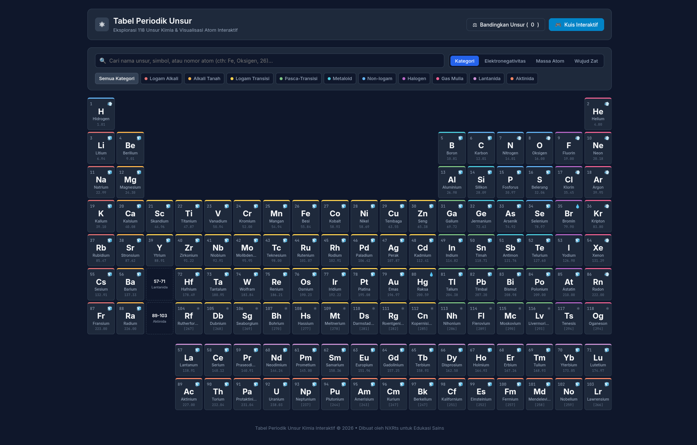

# ⚛️ Tabel Periodik Unsur Kimia Interaktif

Aplikasi web Single-Page Application (SPA) **Tabel Periodik Unsur Kimia** yang interaktif, informatif, dan responsif. Didesain secara bersih (clean minimal dark theme) untuk kemudahan eksplorasi 118 unsur kimia lengkap dalam Bahasa Indonesia.

Dibuat oleh **NXRts** untuk membantu pembelajaran sains dan kimia.

---



---

## ✨ Fitur Utama

- 🧪 **118 Unsur Kimia Lengkap**: Meliputi informasi nomor atom, simbol, nama Indonesia, nama Latin, massa atom, wujud zat, konfigurasi elektron, titik lebur/didih, elektronegativitas, penemu, tahun penemuan, dan fakta unik.
- 📐 **Tata Letak Standar IUPAC**: Kisi 18 Kolom (Golongan) x 7 Baris (Periode) serta deret terpisah untuk **Lantanida (57-71)** dan **Aktinida (89-103)**.
- 🔍 **Pencarian Real-time**: Cari berdasarkan nama unsur, simbol (contoh: `Fe`, `Au`), atau nomor atom (contoh: `1`, `79`).
- 🎨 **Filter Kategori & Mode Peta Panas (Heatmap)**:
  - Mode Tampilan: *Kategori*, *Elektronegativitas*, *Massa Atom*, dan *Wujud Zat (Padat, Cair, Gas, Sintetis)*.
  - Filter kategori per jenis unsur (Logam Alkali, Alkali Tanah, Logam Transisi, Metaloid, Gas Mulia, dll).
- ⚛️ **Visualisasi Atom Bohr 2D**: Menampilkan animasi orbit dan elektron per kulit atom secara real-time di Canvas HTML5.
- ⚖️ **Alat Komparasi Unsur (Compare Mode)**: Bandingkan sifat fisika dan kimia 2 hingga 4 unsur secara berdampingan dalam satu tabel ringkas.
- 🎮 **Kuis Interaktif**: Permainan edukatif tebak nama/simbol/kategori unsur dengan skor real-time untuk menguji pengetahuan.
- ⚡ **Tanpa Dependensi External**: Murni HTML5, CSS3, dan Vanilla JavaScript tanpa framework berat, menjamin kecepatan akses super tinggi.

---

## 🚀 Cara Menjalankan Proyek

Aplikasi ini dapat dijalankan langsung di browser tanpa perlunya kompilasi atau build step.

### 1. Kloning Repositori
```bash
git clone https://github.com/nxrts/Periodik.git
cd Periodik
```

### 2. Buka di Browser
Anda dapat membuka file `index.html` secara langsung dengan melakukan double click, atau menggunakan HTTP server lokal sederhana:

**Menggunakan Python:**
```bash
python3 -m http.server 8080
```
Lalu buka alamat `http://localhost:8080` pada browser Anda.

**Menggunakan Extension VS Code:**
Gunakan extension seperti *Live Server* dan klik **Go Live**.

---

## 🛠️ Struktur Proyek

```text
Tabel Periodik/
├── index.html        # Struktur markup SPA HTML5
├── styles.css        # Styling CSS system (Clean Dark Minimalist)
├── data.js           # Dataset 118 unsur kimia (Bahasa Indonesia)
├── app.js            # Logika interaktivitas, Canvas Bohr 2D, Filter, Komparasi, & Kuis
├── assets/
│   └── Tabel_Periodik.png  # Gambaran pratinjau antarmuka aplikasi
└── README.md         # Dokumentasi proyek
```

---

## 📄 Lisensi

Proyek ini dibuat untuk tujuan edukasi dan terbuka untuk digunakan kembali.

Dibuat dengan ❤️ oleh **NXRts**.
